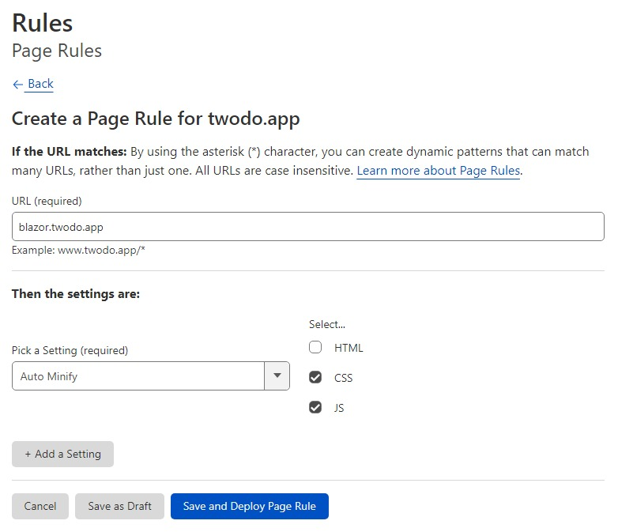

## ASP.NET Core Blazor with SignalR breaks when used with Cloudflare's HTML minification

*Set up a custom Page Rule to exclude HTML minification*

> ref: https://zimmergren.net/solved-asp-net-core-blazor-web-sites-does-not-work-with-cloudflare-html-minification/